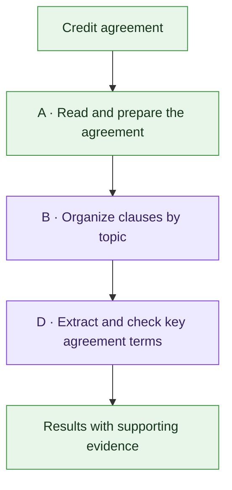
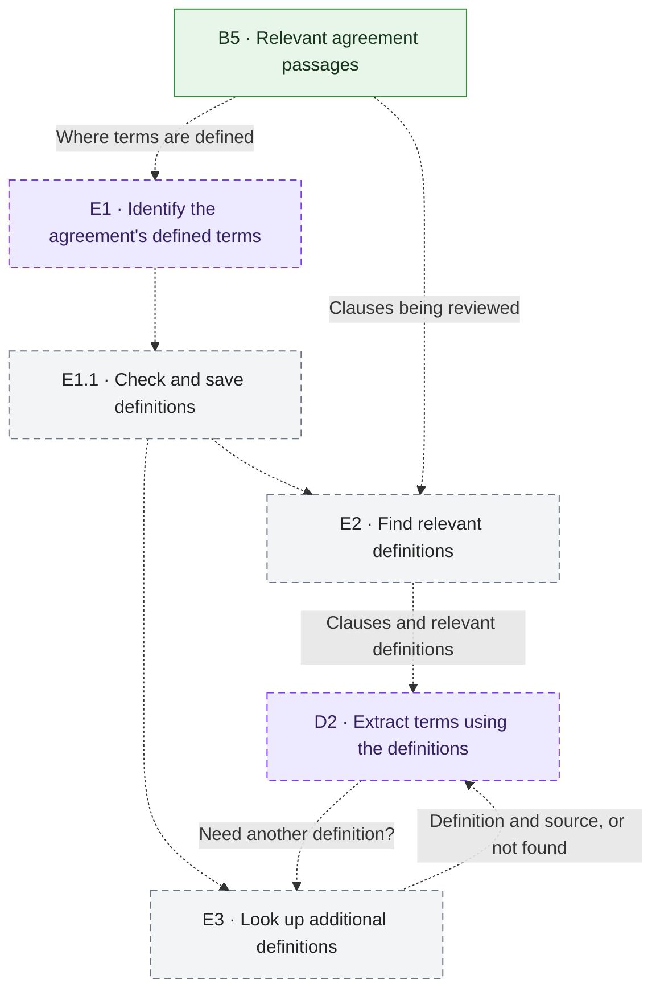

# Credit Agreement Parser

A Python pipeline for converting public credit agreements into structured,
evidence-backed JSON. The target output covers parties, interest terms,
maturity and extension provisions, covenants, repayment terms, call protection,
and other material agreement terms.

The project is under active development. Conversion, page-first chunks, topic
classification/mapping, retrieval and initial Stage D extraction are operational.
Stage D covers parties, facility amounts and interest/fees; legal accuracy still
requires human-reviewed extraction evaluations. The legacy
`extract_parties()` function intentionally returns `not_implemented` rather
than inventing borrower or lender data.

## Pipeline at a glance



Solid lines show implemented flow; purple stages contain LLM calls using the
shared **Stage C** interface. Extraction covers parties, facility amounts and
interest/fees. Every stage records traces; debug mode saves inputs and outputs.
See the [detailed pipeline](docs/conversion_pipeline.md) for individual steps.

## Proposed — for consideration

### Use the agreement's definitions

For consideration — not yet built or finalized. Use the agreement's own
definitions to interpret its terms: provide relevant definitions first, then
look up more when needed. Today, definitions are included with the supporting
passages, but additional lookups are not available. E labels are provisional.



Dashed lines show proposed work; purple boxes involve AI. Extraction already
exists, but these definition lookups are new. Keep the agreement's original
wording and supporting sources, limit repeat lookups, and flag missing
definitions rather than guess their meaning.

## Current status

| Area | Status |
| --- | --- |
| PDF, HTML, and HTM intake | Implemented and tested |
| Local PDF OCR with English RapidOCR | Implemented and tested |
| Gzip-wrapped SEC HTML handling | Implemented and tested |
| Canonical Docling JSON, readable Markdown, and manifest | Implemented and tested |
| Docling PDF heading-hierarchy inference | Implemented and tested |
| Hierarchy sidecar transformation | Implemented and tested (`A10`); optional, default on |
| Sidecar persistence and final Stage A artifact | Implemented and tested (`A11`) |
| Page-first provenance-preserving chunks | Implemented and tested (`B1`) |
| LLM passage classification and provenance-preserving topic map | Implemented and tested (`B2`, `B3`) |
| Evidence retrieval and bundle assembly | Implemented (`B4`, `B5`) |
| Shared OpenCode LLM interface | Implemented and tested (`Stage C`; Responses, Chat and Qwen Messages tiny-live checked) |
| Local telemetry and opt-in detailed debug capture | Implemented; Phoenix deferred |
| Parties, facility amounts and interest/fees | Implemented (`D1–D4`); source-cited JSON, bounded specialist and validation |

The authoritative numbered architecture, Mermaid diagram, and implementation
status live in [`docs/conversion_pipeline.md`](docs/conversion_pipeline.md).
Agreed but unfinished work is tracked in
[`docs/build_backlog.md`](docs/build_backlog.md).

## Extract credit terms

```python
from credit_agreement_extractor import run_pipeline

result = run_pipeline(
    "raw_documents/pdf/011_credit_agreement.pdf",
    model="gpt-5.6-luna",               # Extraction model; call-time override
    reasoning_effort="medium",
    debug=True,
    run_id="credit-terms-review",
)
print(result)
```

The runner chains A → B1 → B2 → B3 and directly starts the Stage D orchestrator
after the completed topic map returns. B2 retains its own default unless
`classification_model` is supplied. Standalone B3 never starts a hidden paid call.
For a saved map, skip conversion/classification:

```python
from credit_agreement_extractor import extract_credit_terms

result = extract_credit_terms(
    topic_map, chunks, conversion=conversion,
    model="gpt-5.6-luna", reasoning_effort="medium", debug=True,
    run_id="saved-map-extraction",
)
```

These inputs are the existing artifact handles returned by `build_topic_map`,
`build_chunks` and `convert_document`. B4/B5 verify their source bindings;
canonical Stage A JSON is required for selected tables. One specialist requests
approved topics and makes a combined extraction call, with at most two attempts.
Model, effort and API-style overrides are supported by the Stage D entry point.
No extra orchestration LLM, external rates, summaries or reviewed answers.

Output includes entity/facility IDs, separate parent-child links, numeric rates
(`0.04` = 4%), stated rate periods, fee/interest distinction, explicit unknowns,
verified citation IDs and a readable `source_evidence` lookup. Pydantic checks
shape; Python checks references/citations and typed Decimal arithmetic. These
checks do not prove the legal interpretation correct. Free-text formulas are
never executed; unknown benchmark inputs remain unknown.

Completed results and manifest-last provenance persist under
`tmp/stage_d/<source-sha256>/<execution-id>/`. Each execution has a fresh directory,
even when a run ID is reused. `tmp/runs/<run-id>/events.jsonl` always records basic
telemetry; debug additionally saves evidence, prompts, visible responses and
validation errors. Artifact paths appear in the `extraction_artifact` event.
The HTML reviewer and local workbench render Stage D results with original cited evidence.

Design and build steps: [Stage D plan](docs/superpowers/plans/2026-10-03-stage-d-extraction.md).

An [AI-assisted extraction reference](docs/extraction_reference_drafts.md) now
contains 97 unreviewed proposed facts across all eight golden documents, with
source evidence and a persistent local human-review app. It is a partial first
pass, not approved gold or an extraction-accuracy result. Human review and
scoring remain pending; these files never feed model/pipeline inputs. Existing
annotations were backed up and verified unchanged.

Launch extraction review with
`uv run --no-sync python -m credit_agreement_extractor.extraction_review --port 60902`
and open http://127.0.0.1:60902/. Approve, edit, reject, mark unsure, add notes or
missing facts, and save/advance. Decisions retain revision history in a separate
ignored SQLite store; the original AI draft stays immutable. Export is for offline
evaluation only, never a pipeline input. The old static HTML is read-only history.

## Local pipeline workbench

```bash
uv run --no-sync python -m credit_agreement_extractor.workbench --port 60900
```

Open [the local workbench](http://127.0.0.1:60900). Select a preserved corpus PDF,
then explicitly press **Run pipeline · uses API**. An OpenCode key must already
be configured in the ignored `.env`; starting a run can incur model charges.
Selecting a saved run, refreshing or inspecting artifacts never calls a model.

- One document job at a time, with B2's existing batch concurrency of five.
- Independent controls: B2 DeepSeek V4 Flash/medium; D2 DeepSeek V4 Pro/high.
  D2 makes one combined extraction call, with at most two sequential attempts.
  Python Stage D APIs also default to Pro/high; general Stage C defaults are unchanged.
- A10 and debug captures default on. Basic events persist with debug off, but
  uncaptured intermediate contents are explicitly unavailable.
- Connected A/B/D component buttons show actual started/completed/cached/skipped/
  failed status. A5/A6 configure the converter; A8 runs conversion. Cache hits
  skip, rather than replay, A4–A11. Batch counts do not pretend to be provider progress.
- Inspect inputs, outputs, readable JSON/Markdown, model exchanges, validation
  diagnostics, retrieved evidence and final extraction. Citation buttons open
  the original PDF page. Topics reuse the real saved-run reviewer.
- Historical runs retain their original numbering. Unrecorded substeps remain
  unrecorded. Controller restart marks unfinished owned jobs interrupted.

The standard-library server binds only `127.0.0.1`, accepts registered PDF IDs
instead of arbitrary paths, validates launch origin/token, and holds an exclusive
controller lock. It is a local debug tool, not a deployed multi-user service.
Outputs stay under `tmp/`, outside immutable `raw_documents/`; ground-truth labels
are never supplied to the pipeline. No new frontend/Python dependency is required.

[Workbench design](docs/superpowers/specs/2026-10-04-pipeline-workbench-design.md)
and [build plan](docs/superpowers/plans/2026-10-04-pipeline-workbench.md).

## Requirements

- Python 3.11
- [uv](https://docs.astral.sh/uv/) for dependency and environment management

Docling, RapidOCR, and the current conversion pipeline run locally. An API key
is not required for document conversion or the test suite.

## Setup

Clone the repository and install the locked dependencies:

```bash
git clone https://github.com/Ashrit-K/credit-agreement-parsing.git
cd credit-agreement-parsing
uv sync --python 3.11
```

To enable B2 live LLM calls, copy the environment template and add
credentials only to the local `.env` file:

```bash
cp .env.example .env
```

```dotenv
OPENCODE_API_KEY=your-key-here
OPENCODE_MODEL=gpt-5.6-luna
OPENCODE_BASE_URL=https://opencode.ai/zen/v1
OPENCODE_API_STYLE=responses
```

The `.env` file is ignored by Git. Never commit API keys or other credentials.
The shared OpenCode client is wired into B2. B2 defaults to Luna/high; the
general client defaults to medium reasoning. Model/API-style/reasoning overrides
are available per call. Stage D reuses this transport for initial legal-term extraction.

## Convert a document

`convert_document()` accepts a PDF, HTML, or HTM path without changing the
source file:

```python
from credit_agreement_extractor import convert_document

artifact = convert_document("raw_documents/pdf/example.pdf")

print(artifact.docling_json_path)
print(artifact.hierarchy_json_path)  # A10 sidecar; None only with use_hierarchy=False
print(artifact.markdown_path)
print(artifact.manifest_path)
```

Run the example through the managed environment:

```bash
uv run python your_script.py
```

By default, conversion artifacts are stored under a content-addressed folder:

```text
tmp/converted/<source-sha256>/
├── document.docling.json  # canonical downstream source
├── document.hierarchy.json # heading context keyed by canonical IDs
├── document.md            # readable development and review copy
└── manifest.json          # source identity and conversion configuration
```

The SHA-256 value is a fingerprint calculated from the source bytes. Repeating
a conversion can reuse a complete cache entry only when both the source
fingerprint, mode and conversion profile match. A11 writes the manifest last.
A10 is enabled by default and writes `document.hierarchy.json`. Explicit
`convert_document(path, use_hierarchy=False)` writes three artifacts under
`tmp/converted/<hash>/a10-disabled/` and returns no hierarchy path.
Enabled cache validation requires that sidecar; a missing file is not treated
as an ablation. Both modes preserve each other's outputs. A5 Docling heading
inference remains enabled; A10 off removes added heading paths, not source text.

## Build page-first chunks

`build_chunks()` consumes a completed Stage A artifact and writes a separate,
schema-versioned Stage B artifact:

```python
from credit_agreement_extractor import build_chunks, convert_document

conversion = convert_document("raw_documents/pdf/example.pdf")
chunks = build_chunks(conversion)

print(chunks.chunks_json_path)
print(chunks.cached)
```

The default output is:

```text
tmp/stage_b/<source-sha256>/document.chunks.json
```

PDF content is page-first. Large pages split only between canonical Docling
items, while tables and explicit Docling lists remain atomic. HTML without page
provenance uses deterministic reading-order chunks targeting 12,000 characters
and prefers heading boundaries. Chunks do not overlap, invent pages, or replace
source wording with summaries. Every item retains its canonical ID so full
bounding-box and character-span provenance can be resolved from Stage A.

The persisted artifact also serves as a development cache. It is reused only
when the source, schema, chunking profile, canonical JSON hash, and hierarchy
sidecar hash (null when disabled) and mode all match. Enabled outputs retain
`tmp/stage_b/<source-sha256>/`. Without A10, B1 reads canonical body references
for order, pages and list/container ancestry, leaves heading paths empty, and
still rejects broken references. B2, B3 and the reviewer support both modes.

## Classify topics and build the map

```python
from credit_agreement_extractor import (
    convert_document, build_chunks, reflect_topics,
    build_topic_map, summarize_run,
)

# Share one identifier across APIs so all stages are inspectable as one run.
options = {"debug": True, "run_id": "agreement-review-001"}
conversion = convert_document("raw_documents/pdf/example.pdf", **options)
chunks = build_chunks(conversion, **options)
labels = reflect_topics(chunks, **options)  # Paid OpenCode calls.
topic_map = build_topic_map(chunks, labels, **options)  # No LLM call.
print(topic_map.topic_map_json_path)
print(summarize_run(options["run_id"]))
```

B1 remains required. `reflect_topics(chunks, *, ...)` consumes only source chunks;
heuristic classification, signals inputs and `use_b2` have been removed.
Current profiles/results declare `pipeline_layout="stage-b-v2"`, which separates
new checkpoints from historical classification runs.

B2 produces one validated final topic list per target chunk, with coherent
passage groups separating `evidence_item_ids` from `context_item_ids`. It reads
the full core chunk, heading paths and one neighboring atomic group on each
side (`boundary_context_groups=1`, or a nonnegative integer override). Every
group requires direct evidence in its core chunk; other targets sharing a batch
do not expand its citation scope. It reviews all chunks in batches of up to five
and 24,000 serialized packet characters; oversized packets stay intact and run
alone. B3 indexes approved topics to these same groups, deduplicating exact
identities only. Neither step summarizes, ranks relevance, invents categories
or implements field extraction. Source order, owners and evidence/context pages
are verified deterministically, not invented by the model.

Independent B2 batches run with `max_concurrency=5` by default. Set
`reflect_topics(..., max_concurrency=1)` for sequential execution, or another
positive integer to bound simultaneous calls. Each batch retains its own
two-attempt limit. Final classifications stay in source order. On failure,
scheduling stops; already running successful calls can finish and checkpoint,
but no partial final artifact is written. Changing concurrency reuses matching
checkpoints. Injected clients must support concurrent `complete()` calls when
the limit is greater than one. Debug exchanges carry unique attempt IDs and
sanitized `_trace` metadata. Saved review pairs B2 requests/responses by attempt
identity and C inputs/outputs by span, not arrival order.
Live concurrency/rate-limit performance has not yet been measured.

Matching validated B2 batch checkpoints resume without repeating paid calls.
Input/settings/prompt or shared topic-definition changes invalidate reuse;
`force=True` bypasses it. B2 uses `b2-passage-classification-v1` with explicit topic meanings
and boundaries maintained in `topic_taxonomy.py`.
The original saved-run HTML retains v1 model calls. A separate completed
GPT-6-Luna/medium review uses the historical v2 prompt with schema-v1 citations,
two-chunk batches and sequential calls;
neither is a measured accuracy benchmark or a live concurrency test.
`reflect_topics(..., model="gpt-5.6-luna", reasoning_effort="low")` overrides
defaults for experiments. Unknown model IDs require an explicit supported
`api_style`; unexpected returned-model substitutions fail rather than hiding them.

New classification/map artifacts are `document.topic-passages.json` and
`document.topic-passage-map.json` under `tmp/stage_b/<source-sha256>/stage-b-v2/`;
explicit A10 opt-out uses `<source-sha256>/a10-disabled/stage-b-v2/`.
B1 keeps its original parent directory. Old schema-v1 files and checkpoints remain
untouched; B3 and the reviewer retain explicit legacy support without inventing
evidence/context roles. Packet hashes, boundary policy and schema version join
the existing input/prompt/definition/model hashes in checkpoint identity.

The shared canonical paragraph/table resolver is deferred. Core tables still
reach B2 through B1's joined rendering. If a selected neighboring table lacks
item-level text, processing raises a clear error before any model call; it does
not silently omit the table or include an unrelated whole page. Revisit the
hash-verified Stage A input contract in the build backlog. Source corpus files
remain untouched.

The passage refinement has **228 passing regression tests**, independent code
review and browser checks on a clearly labeled synthetic development fixture.
These verify the build contract, not legal classification accuracy. No paid
schema-v2 passage rerun or corpus accuracy benchmark has been performed yet.

### Local traces and debug mode

All public pipeline/file APIs accept `debug`, `run_id`, and `trace_root`.
Basic stage events and individual LLM attempts are always saved under
`tmp/runs/<run-id>/events.jsonl`. Debug mode additionally saves intermediate
artifact contents, prompts, responses and validation diagnostics under `debug/`.
Run IDs, nested span IDs, batch IDs and source fingerprints link those records.
Keys and authorization headers are excluded; hidden model reasoning is not saved.

`summarize_run()` groups requests/retries, failures, known token usage, latency
and known/unknown costs by model, stage and document. Luna estimates use a dated
OpenCode rate snapshot; unknown models or unsupported pricing tiers stay unknown.
For high-effort calls, `OpenCodeClient(timeout_seconds=300)` can extend the
transport timeout beyond its 60-second default without changing B2 checkpoint
identity. A timed-out request has unknown provider cost, not zero cost.
For Responses/Chat, `max_output_tokens=32768` can increase the total reasoning
and visible-output allowance beyond the 8,192 default. Higher allowances can
increase actual token spend; record the effective limit in experiment metadata.

Supply a `pricing` mapping to `OpenCodeClient` for custom dated rates, or `{}` to
disable estimates. Estimated costs are not provider bills, and retries count.
Phoenix is deferred: there is no observability server to start.

The live acceptance check used a tiny synthetic excerpt, not a corpus accuracy
evaluation. Responses/Luna/high returned the requested model and reasoning;
Tiny live checks now also pass for DeepSeek V4/V4.1 Flash/high and Qwen3.8
Flash/high. Messages supports `none` and budget-style `high` (16,000 thinking
tokens, 32,768 total output cap); other Messages tiers are rejected, not silently
mapped. Responses/Chat now forward `xhigh` unchanged. GPT-5.6 Luna/xhigh and
GPT-6 Luna/high tiny requests passed. Hidden thinking is excluded from debug
response snapshots while token usage remains available for cost estimates.
Workspace prices are saved in `evaluations/pricing/opencode-workspace-2026-10-01.json`.
Access checks are not document-classification benchmarks.
Unmatched chunks remain included. Classification accuracy awaits reviewed
ground truth; the current corpus checks verify coverage and provenance.

## Party-extraction scaffold API

The package also exposes the intended high-level API shape:

```python
from credit_agreement_extractor import extract_parties

result = extract_parties("raw_documents/pdf/example.pdf")
print(result)
```

This validates the PDF path and returns JSON-serializable data, but it does not
yet parse or infer legal parties. Its current `not_implemented` status is a
deliberate safeguard against fabricated results.

## Evidence and extraction design

### Retrieve original evidence (B4/B5)

```python
from credit_agreement_extractor import retrieve_evidence

# Use the completed B3 map and its matching B1 chunks; no model call here.
evidence = retrieve_evidence(
    topic_map, chunks,
    topics=["parties_and_roles", "facility_and_commitment_terms"],
    conversion=artifact,  # matching Stage A required for table evidence
    debug=True, run_id="evidence-review",
)
print(evidence.evidence_json_path)
```

Downstream extraction chooses approved IDs from `topic_taxonomy.VOCABULARY`;
B4 does not interpret broad requests. It returns all mapped groups for those
topics, with explicit empty matches. Subtopic/parent expansion is not implicit.
B5 adds original evidence and separate supporting context, page numbers,
heading paths and container relationships, including canonical table data.
It never summarizes, ranks, truncates or calls an LLM.

Packets live beside the map under
`evidence/<request-hash>/document.evidence.json`. Groups retain their canonical
IDs/roles and gain `evidence` and `context` records with readable source text.
This supports downstream inference and a future visual topic explorer; that
explorer is not implemented by this change. Basic telemetry logs both stages;
debug mode also captures inputs, selection and the persisted packet.

New schema-v2 maps bind their B1 document hash. For a historical schema-v2 map
without this binding, rebuild B3 with the same saved classifications and chunks
in a new working/output location; no LLM rerun is needed. Historical schema-v1
citations remain readable in review but are not accepted as passage roles here.
Unknown topics, stale map/chunks, corrupt references and missing text fail
explicitly. Table packaging needs a matching canonical Stage A artifact whose
JSON hash matches B1. A10-off and page-less inputs remain supported.

The pipeline keeps extraction results traceable to the source:

1. Stage A converts the document while retaining canonical Docling item IDs,
   reading order, and page provenance.
2. Stage B builds page-first chunks and a topic map that points back to the
   original items instead of replacing them with summaries.
3. Stage C provides shared model routing and API adapters for each LLM step.
4. Stage D's fixed orchestrator coordinates one specialist for parties,
   facilities and interest/fees. It requests B4/B5 evidence and returns validated,
   source-cited JSON; new specialists remain an evaluation-driven later decision.

Values must distinguish missing, uncertain, and not-applicable information.
Models may cite canonical item IDs, but application code resolves those IDs to
verified page and source evidence.

## Review a saved pipeline run

The read-only HTML reviewer joins logged artifacts to original source text,
pages, heading context and tables. Its stage selector exposes Stage A's available
conversion artifacts, B1 chunks, B2 final labels/model
attempts, B3 topic-map memberships, and Stage C transport snapshots. Pending
retrieval/extraction stages show no fabricated outputs. Click a citation to
focus its source passage; review unclassified chunks for possible omissions.
Schema-v2 B2/B3 show passage groups by default: direct evidence is prominent,
supporting context and full source chunks are separately expandable, and source
heading paths/pages remain visible. Current runs have no heuristic suggestions.
Historical unmarked runs retain old stage labels: B2 heuristics (or skipped),
B3 LLM classification and B4 map. New `stage-b-v2` maps old B3 → B2, old B4 → B3,
old pending B5 → B4 and old pending B6 → B5; old heuristic B2 has no current step.
Saved history and schema-v1 citation roles are preserved.

```bash
uv run --no-sync python -m credit_agreement_extractor.review \
  eval-011-20261001-01 tmp/runs/eval-011-20261001-01/review.html
```

Open the exported HTML in a browser. It is self-contained, uses only that run's
saved debug outputs, and makes no LLM calls. Export again to refresh newer logs.
Source text is the converter's wording, not a new transcription of the PDF;
Stage A substeps were not separately traced in this historical run. New runs
record actual A1–A11 boundaries in the workbench; the standalone export stays
read-only and does not persist review labels. Runs need `debug=True` to capture
the content needed for inspection.

## Human topic annotation

Start the separate golden-set annotation page:

```bash
uv run --no-sync python -m credit_agreement_extractor.annotation --port 60901
```

Open `http://localhost:60901/`. The original PDF page (rendered using installed
Poppler) or sandboxed source HTML is on the left. The current canonical passage,
table, pages and optional JSON are on the right, above multi-select topic labels.
Save or Save & next persists human decisions to disk; arrows move between
passages and continue to the next approved document. Definitions appear on hover.
The reading view highlights the current passage within its page context.

The eight approved sources are ordered in `evaluations/golden_documents.json`.
Missing conversions are prepared locally on selection with `use_hierarchy=True`
to keep existing source catalogs stable; no model calls are made.
Labels are under ignored `evaluations/ground_truth/`, separate from pipeline
artifacts. The model pipeline never reads this store. Tests verify identical B2
evidence before and after saving human labels, and reject a human-label file as
a pipeline input. Export downloads the current document's annotation JSON.
Unreviewed passages and reviewed passages with no topics remain distinct.

Taxonomy v2 adds **Contract definitions**, covering explicit contractual
definitions (not mere use of a defined term), alongside any substantive labels.
Previously saved labels and notes are preserved. Old reviews remain completed;
adding a topic never resets progress or requires re-review. The
`reviewed_topics` field records which categories were actually reviewed;
absence of a newly added category is unknown, not a negative label.
Old open tabs must reload before saving; copy unsaved notes before refreshing.
Two verified backups of the 163 pre-update saved records are retained under
`tmp/runs/definitions-backup-20261001/{primary,redundant}/`.

The annotation checkpoint had 184 passing tests. Browser save/reload checks used a disposable
store; no test labels were written into the real human reference set.

## Run the tests

```bash
uv run --frozen pytest -q
```

## Repository layout

```text
src/credit_agreement_extractor/  # Python package
tests/                           # unit and regression tests
docs/                            # architecture, plans, and corpus audits
raw_documents/pdf/               # immutable source PDFs
raw_documents/htm/               # immutable source HTML/HTM files
tmp/converted/                    # ignored generated conversion artifacts
tmp/stage_b/                      # ignored B1–B3 artifacts and B2 checkpoints
tmp/runs/                         # ignored local telemetry and debug snapshots
```

Files under `raw_documents/` are the preserved public source corpus. Do not
rename, overwrite, delete, or silently transform them. Generated artifacts and
extraction results belong outside that directory.

## Development conventions

- Use `uv` and the project virtual environment for all Python work.
- Keep conversion, legal-term extraction, LLM reasoning, validation, and
  evidence capture independently testable.
- Update the pipeline diagram and build backlog together when a tracked
  component starts or finishes.
- Do not mark a diagram component implemented until its acceptance checks pass.
- Preserve uncertainty and source wording instead of guessing legal facts.

See [`AGENTS.md`](AGENTS.md) for the complete project instructions.
