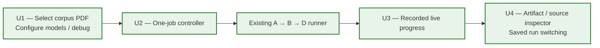
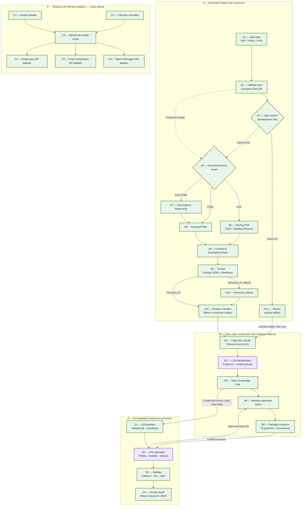

# Document Conversion and Extraction Pipeline

This document is the authoritative view of the credit-agreement pipeline. The
diagram distinguishes what exists today from the architecture we have agreed to
build next.

## Python entry point

```python
from credit_agreement_extractor import build_chunks, convert_document

artifact = convert_document("raw_documents/pdf/example.pdf")
chunks = build_chunks(artifact)

print(artifact.docling_json_path)
print(artifact.hierarchy_json_path)  # A10 enabled by default; opt out with use_hierarchy=False
print(artifact.markdown_path)
print(artifact.manifest_path)
print(chunks.chunks_json_path)
```

The default output root is `tmp/converted/`. Each source is placed in a folder
named with its SHA-256 fingerprint. Callers do not calculate or supply this
fingerprint: the function calculates it from the source bytes. Repeating a call
with identical source bytes reuses a complete cached conversion only when its
conversion-profile identifier also matches the current settings.

The cache short circuit is currently a development optimization. A10 is
optional and enabled by default under `tmp/converted/<source-sha256>/`.
Explicit `use_hierarchy=False` outputs live under
`tmp/converted/<source-sha256>/a10-disabled/`. Mode-sensitive profiles and
manifest declarations prevent cross-mode reuse. Enabled mode requires all four
files and a valid schema-version-1 sidecar with the same source fingerprint;
disabled mode requires three files and an explicitly disabled sidecar record.
Production cache policy remains a separate decision.

## Conversion artifact contract

The completed Stage A artifact contains four files by default, three with A10 disabled:

- `document.docling.json` is the canonical conversion. It remains unchanged
  after Docling exports it and retains Docling item identifiers and available
  provenance such as page numbers, character spans, and bounding boxes.
- `document.md` is a readable derivative for manual review and debugging. It is
  not the downstream source of truth.
- Optional `document.hierarchy.json` is the A10 sidecar. It adds generic heading
  paths and hierarchy-quality warnings keyed by canonical Docling item IDs. It
  does not copy or rewrite the complete document.
- `manifest.json` records source identity, converter version, OCR and heading-
  hierarchy configuration, conversion profile, gzip normalization, artifact
  names, and final conversion status.

Both modes are implemented and tested. When enabled, A10 builds and persists the
hierarchy mapping after canonical serialization; otherwise A9 routes directly
to A11. A11 writes the completed manifest last after every mode-required output
exists. Disabled mode returns `hierarchy_json_path=None` and records
`hierarchy_sidecar={"enabled": false, "status": "disabled"}` with a null
`artifacts.hierarchy_json`. A missing enabled sidecar is an error, not a bypass.

OCR is enabled only for PDF conversion. The manifest records configuration, not
a claim that OCR was necessary on a particular born-digital page; Docling's OCR
mode decides which page regions need recognition.

Several SEC-sourced `.htm` files are actually gzip streams. The function detects
the gzip signature from the bytes, creates a temporary plain-HTML copy for
Docling, and removes that copy afterward. It never rewrites the source file.

## Frozen hierarchy design

Optional-A10 ablation is implemented; see the [implementation plan](superpowers/plans/2026-10-02-optional-a10.md).
A10 now defaults on; use `convert_document(path, use_hierarchy=False)` to
run the explicit ablation without added heading paths.
This toggle does not disable A5's Docling inference or repair fragmented text.
Its accuracy benefit remains an evaluation question, not an implementation claim.
The completed 2026-10-02 011 joint A10/B2 ablation observed lower F1 for all
three tested models with both disabled than with only B2 disabled. This is
single-document evidence, with size-bounded batch packing also changing;
see the completed experiment in [build backlog](build_backlog.md). These observations motivate the A10-on default, but do not establish a
corpus-wide accuracy improvement.

Within A5, Docling's built-in heading-hierarchy inference is enabled for PDF
conversion so the canonical export contains all structure Docling can recover.
A5 also enables parsed-page generation, records both settings in the manifest,
and uses a distinct conversion profile so older caches are not reused.

A10's pure builder consumes the canonical JSON and produces the in-memory
sidecar mapping with:

- generic heading depths and ancestor paths rather than legal-specific labels
  such as `Article`, `Section`, or `Clause`;
- mappings keyed by canonical IDs such as `#/texts/17` and `#/tables/3`;
- page provenance copied from the referenced canonical items;
- one small warning taxonomy: `no_headings`, `flat_levels`,
  `skipped_levels`, and `non_monotonic_pages`;
- explicit validation failures for broken references or cycles rather than
  treating corrupt structure as a warning.

Hierarchy is useful context, not an authority that can discard content. The
builder does not alter reading order, rewrite source text, infer legal meaning,
or remove items. When hierarchy is sparse or imperfect, Stage B still has the
canonical page-first reading order. Persisting this mapping as
`document.hierarchy.json` and adding it to Stage A's cache/artifact contract are
implemented through A11.

## B1 chunk artifact contract

B1 is implemented as a separate Stage B operation:

```python
chunks = build_chunks(artifact)
```

It reads canonical Docling JSON and the optional A10 sidecar and writes:

```text
tmp/stage_b/<source-sha256>/document.chunks.json
tmp/stage_b/<source-sha256>/a10-disabled/document.chunks.json  # explicit opt-out mode
```

The chunk artifact is schema-versioned and records its source fingerprint,
chunking profile, `inputs.use_hierarchy`, the canonical JSON hash and nullable
hierarchy JSON hash. It contains
deterministic chunk IDs, neighbor links, exact canonical item IDs, verified
pages, source wording, table renderings, hierarchy paths, and container/list
relationships. It does not duplicate bounding boxes or character spans; those
remain resolvable from canonical JSON through each retained item ID.

Without A10, B1 walks validated canonical body/group references for reading
order, pages and container/list ancestry. Heading items stay in source content,
but `heading_path=[]`. Broken references, cycles and repeated references still
fail. B2/B3 and saved-run review work in both modes; their outputs inherit
the separate B1 directory and input fingerprints. Annotation preparation stays
explicitly enabled to avoid changing existing human source catalogs.

PDFs use page-first boundaries. Large pages split only between atomic units,
while individual leaves, tables, and explicit Docling lists remain intact.
Fully page-less documents use heading-aware reading-order chunks targeting
12,000 characters. B1 creates no overlap and never fabricates page provenance.

The persisted file also acts as a development cache. A source, profile, schema,
or Stage A input-hash mismatch rebuilds only B1 and does not rerun Docling.

## Topic-map and evidence rule

The current layout is explicitly `stage-b-v2`: B1 chunks → B2 LLM passage
classification → B3 topic-map construction → B4 evidence retrieval →
B5 packaging. `reflect_topics(chunks, *, ...)` consumes source chunks
without heuristics; `classify_chunks`, `TopicSignalsArtifact`, phrase rules,
signals inputs and `use_b2` have been removed. Topic IDs/definitions, model
settings and passage evidence/context roles remain unchanged.

Historical unmarked runs keep their original IDs and saved labels: old B2
heuristics (or skipped), B3 classification and B4 map. The explicit mapping is
old B3 → current B2, old B4 → current B3, old pending B5 → current B4 and old
pending B6 → current B5; deleted heuristic B2 has no current counterpart.
Historical plans and evaluation reports retain their numbering. Profiles/results
include `pipeline_layout='stage-b-v2'` and current `b2-checkpoints` have distinct
identity; historical checkpoints are never silently reused.

## B2/B3 contracts and local observability

Human reference labels are authored in the separate local `annotation.py` /
`annotation.html` app, using original canonical passages from the approved golden
documents. They persist only in `evaluations/ground_truth/`; no processing stage
or purple LLM step reads them. Future evaluation compares completed independent
model runs with human labels afterward. The annotation surface is outside the
document-processing diagram; it does not change B1/B2/B3 contracts.
Shared taxonomy v2 adds `contract_definitions` as a ninth top-level topic.
Explicit definitions can also carry substantive labels. Human annotation
coverage is per-topic: legacy reviews retain all saved decisions and leave the
new topic unknown until reviewed. No component IDs or implementation-status
lines change for this additive vocabulary update.

`reflect_topics(chunks, *, ...)` is implemented. It sends up to five chunks
per batch, bounded by 24,000 serialized packet characters (oversized packets
run alone), using `gpt-5.6-luna` with high reasoning by default. Model,
reasoning effort, and API style can be overridden. Source text, table content,
heading context and bounded source neighbors reach the model.
The `b2-passage-classification-v1` prompt uses shared, versioned topic definitions from
`topic_taxonomy.py`, including boundaries between incidental party mentions,
payment defaults, interest terms, and prepayment premiums. Both the prompt and
definition hashes participate in checkpoint identity. Topic IDs and definitions are unchanged. Historical schema-v1 runs (including the original Amerigo run
and the later GPT-6-Luna/medium v2-prompt run) remain historical evidence, not
evaluations of schema-v2 passage selection. No live passage-level quality
improvement has been measured yet.

B2 validates one result per target chunk, approved topics only, and groups of
direct-evidence and supporting-context IDs in that target's explicit core,
heading and bounded-neighbor scope. Every group requires core direct evidence;
another target in the same request does not expand allowed IDs. It adds parents for approved
subtopics. There are no possible-topic buckets, confidence scores, Jev gates,
or second opinions. Two attempts maximum handle transient API or invalid-output
failures; authentication errors and model substitutions stop immediately.

Independent batches run in a bounded thread pool with `max_concurrency=5`
by default. A positive integer controls simultaneous batches; booleans are
rejected, and `max_concurrency=1` preserves sequential execution. Each batch
owns its two-attempt lifecycle and validated checkpoint. Copied trace contexts
retain B2 parent spans, batch/attempt settings and nested C attribution;
serialized JSONL appends and unique snapshot/attempt IDs support concurrent
debug exchanges. Injected clients must allow concurrent `complete()` calls.
Debug dictionaries and serialized dataclasses carry sanitized `_trace`
run/span/stage/batch/attempt metadata. The reviewer pairs B2 model attempts by
attempt ID and C boundaries by span ID, including out-of-order responses.
Final classifications are validated and persisted in source order, independent
of completion order. Failure stops new scheduling and cancels unstarted work;
in-flight calls may finish and save successful checkpoints. No partial final
artifact replaces a completed result. Concurrency changes do not invalidate
checkpoints, because evidence, batching and classification policy are unchanged.

Validated batches are checkpointed by input hashes and settings. Repeated calls
reuse matching checkpoints; `force=True` requests fresh classification. A failed
new run does not replace the last successfully completed result. B2 persists
`document.topic-passages.json` under `tmp/stage_b/<source-sha256>/stage-b-v2/`;
explicit A10 opt-out uses `<source-sha256>/a10-disabled/stage-b-v2/`.
B1 stays in its original parent directory. `build_topic_map(chunks,
classifications)` revalidates it and writes `document.topic-passage-map.json`
in the same layout directory, preserving historical files.
B3 indexes topic -> original passage groups in source order, deduplicating exact
group identities only. Both retain an explicit unclassified-target list. Legacy
schema-v1 input dispatch still writes `document.topic-map.json`; it does not
invent direct/context roles. B3 neither summarizes nor calls an LLM.

### Implemented B2/B3 passage-level refinement

The solid B2/B3 components now implement schema-v2 topic-specific groups with
separate `evidence_item_ids` and `context_item_ids`. B1 packaging and the single
B2 call remain unchanged. The default `boundary_context_groups=1` supplies one
atomic neighbor on each side; no text is truncated. Source-order IDs, stable
group identity, owner chunks and evidence/context pages are derived and verified
in code. Parent subtopics retain the same group roles. B3 recomputes provenance
and packet identity, retains nonidentical overlaps and indexes exact groups.
Review foregrounds selected passages with pages/headings and expandable context
and full source chunks. Schema, complete packet, boundary, prompt and definition
hashes prevent legacy checkpoint reuse. Implementation details are in the
[implementation plan](superpowers/plans/2026-10-01-b3-b4-passage-evidence.md).
No new numbered processing stage or additional LLM pass is introduced.

The shared paragraph/table source-item resolver is separately **deferred**.
It will reuse canonical Stage A cells for precise B2 table context and human
review without changing B1 or adding a table-processing stage. Until then,
missing neighboring-table text is an explicit input error, not silently omitted
context. Core tables retain B1's full joined rendering.

Stage C's shared `OpenCodeClient` implements explicit model routing, Responses,
Chat Completions and Qwen Messages adapters, and the application User-Agent required by the
tested gateway. Its general reasoning default is medium; B2 explicitly selects
high. Unknown model routes need an explicit supported API-style override.
Tiny live checks passed for GPT-6 Luna/high, GPT-5.6 Luna/xhigh, DeepSeek V4
Flash/high, DeepSeek V4.1 Flash/high and Qwen3.8 Flash/high. These verify access,
not classification accuracy or a provider's internal effort implementation.
Responses/Chat forward `xhigh` unchanged. Qwen Messages supports `none` or
`high`; high explicitly uses a 16,000-token thinking budget and 32,768 total
output allowance, matching OpenCode's budget-style high variant. Unsupported
Messages tiers fail before requests. Model identities must match B2 requests.
Messages cache-read/write tokens are included in normalized input totals and
priced once. All response debug snapshots omit hidden reasoning and signatures.
`OpenCodeClient(timeout_seconds=60)` exposes a positive finite transport timeout.
The five-model 011 benchmark uses 300 seconds for high-effort responses; changing
this transport limit does not change model/prompt/evidence checkpoint identity.
Responses and Chat output allowances are configurable via
`OpenCodeClient(max_output_tokens=8192)`. The benchmark's GPT-5.6/xhigh and
DeepSeek V4.1/high recoveries use 32,768 after recorded outputs exhausted the
original allowance entirely on reasoning. Effective request limits and any
machine-only retry feedback are saved in recovery policies and C request traces;
the benchmark must disclose these interventions when comparing cost/accuracy.

The 2026-10-02 `jev-1.13` classification benchmark uses a separate experimental
System One transport in `evaluations/jev_benchmark.py`, not a production B2/C
adapter or a new diagram component. Each source item has independent approved
topic questions with a fixed 0.5 yes-probability cutoff, full owning-chunk context
and existing boundary context. No human labels enter those requests; scoring is
offline only. Native item decisions are compared with B2 direct-evidence item
labels, not claimed to reproduce B2 passage/context grouping. All probabilities
and measured usage persist; first-run trace consolidation and missing original
HTTP-envelope snapshots are explicitly documented in the saved recovery record.

All public pipeline/file APIs accept `debug=False`, `run_id=None`, and
`trace_root='tmp/runs'`. Use one run ID across separately called stages to link
them. Metadata and LLM usage/latency/cost are always appended to
`tmp/runs/<run-id>/events.jsonl`; `debug=True` also copies intermediate artifacts,
prompts, responses, and validation diagnostics under `debug/`. Secrets and
authorization headers are excluded; hidden model reasoning is not captured.
`summarize_run(run_id)` aggregates requests, retries, usage, costs, failures,
and latency by model/stage/document. Costs are reported only for explicit
amount/currency objects, otherwise estimated from dated gateway rates or unknown.
The default pricing snapshot covers Luna inputs up to 272K tokens, checked
2026-10-01; other models/tiers need explicit rates. Reasoning tokens are already
included in output totals and are not charged twice. These estimates are not bills.

Phoenix is deferred and is not a runtime dependency. B4/B5 retrieval and initial
Stage D extraction are implemented. Small smoke tests verify wiring, not legal
classification accuracy across the corpus.

Implemented B1 begins from canonical Docling items and builds page-first chunks. Page
boundaries guide chunk starts and ends, while tables remain atomic where
practical and lists are not split midway. Each chunk keeps its item IDs, page
numbers, neighboring chunk links, and any A10 heading path.

Every chunk reaches B2's batched LLM passage classification directly from B1.
Its final labels feed B3's provenance-preserving topic map;
neither may replace the underlying
source text with a summary. The map retrieves likely evidence for a requested
field, and request assembly sends that original evidence and its identifiers to
the extraction model.

The extraction model may cite retained item identifiers, but it must not invent
page numbers or coordinates. Application code resolves cited identifiers and
copies verified provenance into the structured result. Missing or uncertain
required fields remain explicit. Broader retrieval is a later bounded-policy
decision; the first Stage D does not automatically expand or read the full source.

Stage D uses one public fixed Python orchestrator and one specialist for parties,
facility amounts and interest/fees. `extract_credit_terms(topic_map, chunks, ...)`
accepts source artifact handles; the specialist requests approved taxonomy topics
through shared B4/B5 tools and makes a combined C call. Pydantic validates JSON;
Python validates source citations, entity references and supported rate arithmetic.
Parent-child links stay separate from agreement roles; numeric rates retain their
stated period, so monthly interest and one-time fees are not annualized silently.

`run_pipeline(path, ...)` directly calls D after successful B3 completion and emits
`topic_map_ready`. Standalone B3 remains free of hidden paid work. Saved maps can
enter D directly without reconversion/reclassification. Maximum two attempts;
auth, configuration or substitution failures stop. No resolver LLM, autonomous
loop, ground-truth inputs or external rate lookup. Missing values remain explicit.
Free-text formulas are never executed. Completed output and provenance manifest
persist in unique execution directories under `tmp/stage_d/<source-sha256>/`;
manifest-last completion and debug traces preserve errors and historical results.

The historical pending sleeve view and later abstract D1 are superseded by initial
D1–D4 below. More specialists and broader extraction/evaluations remain later work.
See the [design](superpowers/specs/2026-10-03-stage-d-extraction-design.md) and
[implementation plan](superpowers/plans/2026-10-03-stage-d-extraction.md).

Stage C is a cross-cutting interface rather than a step in the document data
flow. Every purple LLM box uses the shared routing and transport contract in
Stage C, while supplying its own system prompt, evidence, and response schema.
The diagram therefore keeps C isolated instead of routing document artifacts
through its adapter boxes.

## Pipeline

### B4/B5 downstream evidence entry point

`retrieve_evidence(topic_map, chunks, *, topics, conversion=None, debug=False,
run_id=None, trace_root="tmp/runs")` returns an `EvidenceArtifact` pointing to
the persisted readable JSON packet. B4 accepts only approved taxonomy IDs,
retrieves every mapped passage group for them and reports empty matches.
Downstream extraction resolves broad topics itself; no intermediate model.

B5 attaches original source text, separate evidence/context roles, pages,
headings and container ancestry. Tables use the existing canonical grid
renderer with a Stage A hash matching B1; no joined-page substitution.
There is no truncation, ranking, implicit parent expansion or LLM call.
The shared classifier/reviewer source-item resolver remains deferred.

New schema-v2 maps include `chunks_document_sha256`, binding their B1 content.
Rebuild older schema-v2 maps through deterministic B3 before retrieval; saved
classifications need not be rerun. Historical schema-v1 is not reinterpreted.
Packets persist beside the map at `evidence/<request-hash>/document.evidence.json`
with input fingerprints; distinct requests/maps/modes stay isolated. Basic
events record B4/B5, debug captures source inputs, selection and the final packet.
The packet can power a later visual topic explorer; existing HTML remains as-is.

Acceptance includes strict topic/hash/citation/group-order/provenance rejection,
full wording and context separation, canonical table cells, trace failures and
immutable input tests. A source-only saved 011 smoke packaged 8 parties, 11
facility/commitment and 8 interest groups (85 direct-evidence records) without
paid calls or human-label reads; this is wiring evidence, not an accuracy claim.


### Human review surface

The implemented read-only HTML exporter in `review.py` is an inspection surface,
not a new document-processing stage. It loads an existing debug run and exposes
A conversion artifacts, B1 source chunks, B2 final classifications and model
attempts, B3 topic assignments, and C
provider payloads/responses. Original source text, pages, tables and heading
context are displayed beside labels; clicking a citation focuses its source.
Unclassified chunks remain reviewable. Current B2/B3 runs show final passage
groups with direct evidence
prominent and supporting context/full chunks expandable. Historical runs show
explicitly legacy supporting citations without fabricated roles. Heading paths
are source provenance, displayed separately from model-selected context. Raw inputs, output artifacts
and events are expandable. Narrow browser panels use source/results switching;
wide browsers show them side-by-side.

Exports are snapshots, refreshed by rerunning the export command in README.
They do not run conversion/models or invent outputs for downstream D. The current
HTML reviewer exposes recorded B4/B5 packets and D extraction with original
cited source. Historical evaluation runs lack separately traced Stage A substeps;
new runs record actual A1–A11 boundaries. Phoenix remains deferred.

### Local execution and review interface — implemented

`workbench.py` serves `workbench.html` on `127.0.0.1:60900`. This interface is
outside the pipeline: it starts one real runner job, polls durable events and
reuses the saved reviewer. It never replaces pipeline artifacts with illustrative
data. A5/A6 progress denotes converter setup; A8 denotes conversion. Cache hits
record A3.1 and explicitly skip A4–A11. Unrecorded historical substeps remain unknown.
Debug adds actual inputs/outputs, model exchanges and validation diagnostics;
debug-off runs still show real events. The source PDF and verified citations are
available alongside readable artifacts. B2 batch counts preserve concurrent
attempt identities, not invented completion percentages.

UI defaults: B2 DeepSeek V4 Flash/medium, D2 DeepSeek V4 Pro/high, A10/debug on.
D2 remains one combined extraction call. Controls override B2 and D2 independently.
Only a deliberate launch spends API tokens; polling and history inspection are read-only.



Solid boxes/arrows indicate tested interface wiring. Purple inference remains
inside B2 and D2 in the authoritative pipeline diagram below; Stage C stays
cross-cutting, not an artifact-processing stage. The workbench is loopback-only,
has launch origin/token checks and exclusive controller ownership, and preserves
raw documents and ground-truth isolation.

### Architecture diagram

Status and cognitive work use separate visual signals:

- Capital letters identify major stages; numbers identify components within a
  stage, such as `A10` or `B2`.
- Solid borders and arrows mean implemented and tested.
- Dashed borders and arrows mean pending.
- Amber boxes identify provisional planned steps whose design is still subject
  to change.
- Purple boxes identify LLM or other cognitive inference steps, regardless of
  implementation status.

A10, A11, and B1 are implemented and tested. Their boxes and the A11-to-B1
connection are solid. B1-to-B2-to-B3 is solid; B2 is purple because it
uses an LLM. B3-to-B4-to-B5 is solid after retrieval/packaging acceptance checks.
Initial D1–D4 and the composed readiness/tool connections are solid after acceptance.
D2 is purple because it calls the LLM; fixed D1/D3/D4 use implemented green boxes.
Shared C1–C6 transport is implemented and tested.



The development cache shortcut returns through A3.1 only when all mode-required
files and their recorded identities validate, then hands that artifact to B1.
This A3.1-to-B1 shortcut is development-only; the target production route still
bypasses the cache through A4 and reaches B1 through A11.
On a cache miss, A9 writes canonical
JSON and Markdown, optionally A10 builds the sidecar, and A11 writes the
completed manifest last before returning the enriched artifact.

B1 runs separately through `build_chunks()`. It reuses a validated Stage B
artifact when possible; otherwise it deterministically rebuilds
`document.chunks.json` from canonical JSON and optional hierarchy. B1 is the solid
handoff from completed conversion into implemented B2/B3 topic mapping.
