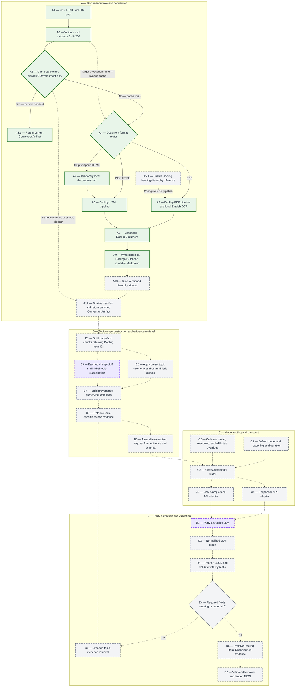

# Document Conversion and Extraction Pipeline

This document is the authoritative view of the credit-agreement pipeline. The
diagram distinguishes what exists today from the architecture we have agreed to
build next.

## Python entry point

```python
from credit_agreement_extractor import convert_document

artifact = convert_document("raw_documents/pdf/example.pdf")

print(artifact.docling_json_path)
print(artifact.markdown_path)
print(artifact.manifest_path)
```

The default output root is `tmp/converted/`. Each source is placed in a folder
named with its SHA-256 fingerprint. Callers do not calculate or supply this
fingerprint: the function calculates it from the source bytes. Repeating a call
with identical source bytes reuses a complete cached conversion only when its
conversion-profile identifier also matches the current settings.

The cache short circuit is currently a development optimization. Once A10 is
implemented, a cache entry will be complete only if it also contains the
versioned hierarchy sidecar produced from the same canonical Docling JSON and
conversion profile. Production cache policy remains a separate decision.

## Conversion artifact contract

The completed Stage A artifact will contain four files:

- `document.docling.json` is the canonical conversion. It remains unchanged
  after Docling exports it and retains Docling item identifiers and available
  provenance such as page numbers, character spans, and bounding boxes.
- `document.md` is a readable derivative for manual review and debugging. It is
  not the downstream source of truth.
- `document.hierarchy.json` is the planned A10 sidecar. It adds generic heading
  paths and hierarchy-quality warnings keyed by canonical Docling item IDs. It
  does not copy or rewrite the complete document.
- `manifest.json` records source identity, converter version, OCR and heading-
  hierarchy configuration, conversion profile, gzip normalization, artifact
  names, and final conversion status.

The Docling JSON and Markdown outputs are implemented. The hierarchy sidecar
and the enriched final manifest/artifact contract are pending A10 and A11.

OCR is enabled only for PDF conversion. The manifest records configuration, not
a claim that OCR was necessary on a particular born-digital page; Docling's OCR
mode decides which page regions need recognition.

Several SEC-sourced `.htm` files are actually gzip streams. The function detects
the gzip signature from the bytes, creates a temporary plain-HTML copy for
Docling, and removes that copy afterward. It never rewrites the source file.

## Frozen hierarchy design

Docling's built-in heading-hierarchy inference will be enabled for PDF
conversion so that the canonical export contains all structure Docling can
recover. This is A5.1 and is not implemented yet.

A10 will consume the canonical JSON and produce `document.hierarchy.json` with:

- generic heading depths and ancestor paths rather than legal-specific labels
  such as `Article`, `Section`, or `Clause`;
- mappings keyed by canonical IDs such as `#/texts/17` and `#/tables/3`;
- page provenance copied from the referenced canonical items;
- one small warning taxonomy: `no_headings`, `flat_levels`,
  `skipped_levels`, and `non_monotonic_pages`;
- explicit validation failures for broken references or cycles rather than
  treating corrupt structure as a warning.

Hierarchy is useful context, not an authority that can discard content. A10
will not alter reading order, rewrite source text, infer legal meaning, or
remove items. When hierarchy is sparse or imperfect, Stage B still has the
canonical page-first reading order.

## Topic-map and evidence rule

Stage B begins from canonical Docling items and builds page-first chunks. Page
boundaries guide chunk starts and ends, while tables remain atomic where
practical and lists are not split midway. Each chunk keeps its item IDs, page
numbers, neighboring chunk links, and any A10 heading path.

Every chunk then receives one or more topic labels from a preset credit-
agreement taxonomy. Deterministic signals and a batched cheap-LLM classifier
feed a provenance-preserving topic map; neither may replace the underlying
source text with a summary. The map retrieves likely evidence for a requested
field, and request assembly sends that original evidence and its identifiers to
the extraction model.

The extraction model may cite retained item identifiers, but it must not invent
page numbers or coordinates. Application code resolves cited identifiers and
copies verified provenance into the structured result. Missing or uncertain
required fields trigger broader retrieval from the topic map.

## Pipeline

Status and cognitive work use separate visual signals:

- Capital letters identify major stages; numbers identify components within a
  stage, such as `A10` or `B3`.
- Solid borders and arrows mean implemented and tested.
- Dashed borders and arrows mean pending.
- Amber boxes identify provisional planned steps whose design is still subject
  to change.
- Purple boxes identify LLM or other cognitive inference steps, regardless of
  implementation status.



The current implementation still writes `manifest.json` as part of its A9
persistence step and may return through A3.1. The target A10/A11 increment will
make the sidecar part of cache completeness, finalize the manifest only after
all artifacts exist, and return the enriched artifact through A11.
