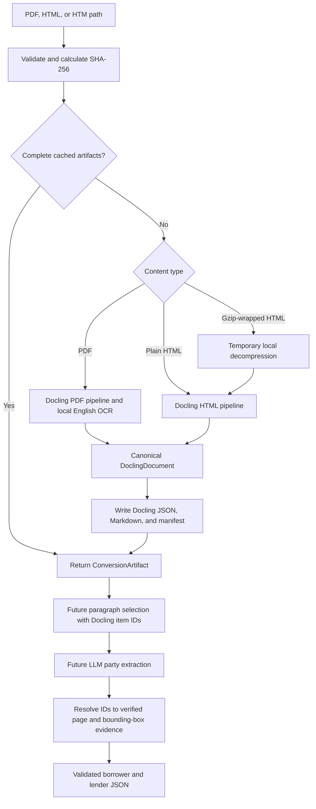

# Document Conversion Pipeline

The conversion layer turns one preserved source agreement into two complementary
representations plus a small operational manifest. It runs locally and does not
call OpenCode or any other LLM service.

## Python entry point

```python
from credit_agreement_extractor import convert_document

artifact = convert_document("raw_documents/pdf/example.pdf")

print(artifact.docling_json_path)
print(artifact.markdown_path)
print(artifact.manifest_path)
```

The default output root is `tmp/converted/`. Each source is placed in a folder
named with its SHA-256 fingerprint. Callers do not calculate or supply this
fingerprint: the function calculates it from the source bytes. Repeating a call
with identical source bytes reuses a complete cached conversion only when its
conversion-profile identifier also matches the current settings.

## Generated artifacts

- `document.docling.json` is the canonical conversion. It retains Docling's
  document items, hierarchy, item identifiers, and available provenance such as
  page numbers, character spans, and bounding boxes.
- `document.md` is a readable derivative. It is useful for manual review and for
  constructing concise LLM input, but it is not the source of truth for page
  geometry.
- `manifest.json` records source identity, converter version, OCR configuration,
  conversion profile, gzip normalization, artifact names, and conversion status.

OCR is enabled only for PDF conversion. The manifest records configuration, not
a claim that OCR was necessary on a particular born-digital page; Docling's
default OCR mode decides which page regions need recognition.

Several SEC-sourced `.htm` files are actually gzip streams. The function detects
the gzip signature from the bytes, creates a temporary plain-HTML copy for
Docling, and removes that copy afterward. It never rewrites the source file.

## Evidence rule

Future extraction code should select text from the canonical JSON and retain the
corresponding Docling item identifier, such as `#/texts/17`. An LLM may cite that
identifier, but it must not invent page numbers or coordinates. Application code
will resolve the cited item and copy its verified provenance into the structured
extraction result.

## Pipeline


