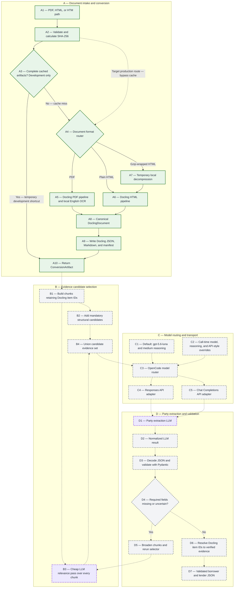

# Document Conversion Pipeline

The conversion layer turns one preserved source agreement into two complementary
representations plus a small operational manifest. It runs locally and does not
call OpenCode or any other LLM service.

## Python entry point

```python
from credit_agreement_extractor import convert_document

artifact = convert_document("raw_documents/pdf/example.pdf")

print(artifact.docling_json_path)
print(artifact.markdown_path)
print(artifact.manifest_path)
```

The default output root is `tmp/converted/`. Each source is placed in a folder
named with its SHA-256 fingerprint. Callers do not calculate or supply this
fingerprint: the function calculates it from the source bytes. Repeating a call
with identical source bytes reuses a complete cached conversion only when its
conversion-profile identifier also matches the current settings.

This cache short circuit is currently a development optimization that reduces
latency while the pipeline is being built and tested. It is not the intended
default production route: absent an explicit production cache policy, a
production run should continue through content-type routing and conversion so
the submitted document is processed in that run.

## Generated artifacts

- `document.docling.json` is the canonical conversion. It retains Docling's
  document items, hierarchy, item identifiers, and available provenance such as
  page numbers, character spans, and bounding boxes.
- `document.md` is a readable derivative. It is useful for manual review and for
  constructing concise LLM input, but it is not the source of truth for page
  geometry.
- `manifest.json` records source identity, converter version, OCR configuration,
  conversion profile, gzip normalization, artifact names, and conversion status.

OCR is enabled only for PDF conversion. The manifest records configuration, not
a claim that OCR was necessary on a particular born-digital page; Docling's
default OCR mode decides which page regions need recognition.

Several SEC-sourced `.htm` files are actually gzip streams. The function detects
the gzip signature from the bytes, creates a temporary plain-HTML copy for
Docling, and removes that copy afterward. It never rewrites the source file.

## Evidence rule

Future extraction code should chunk all text from the canonical JSON while
retaining the corresponding Docling item identifiers, such as `#/texts/17`. A
cheap selector LLM will review every chunk and over-select items that may support
the requested fields. Deterministic structural candidates, such as the opening
party block, definitions, lender tables, guarantor provisions, and signature
blocks, are unioned with the LLM selections so the selector cannot discard those
anchors.

The extraction LLM may cite retained item identifiers, but it must not invent
page numbers or coordinates. Application code will resolve every cited item and
copy its verified provenance into the structured extraction result. Missing or
uncertain required fields trigger broader retrieval and another selector pass.

The selector is designed to improve recall, not guarantee correctness. Its miss
rate must be measured on representative agreements before its output can be used
to exclude evidence permanently.

## Pipeline

Status and cognitive work use separate visual signals:

- Capital letters identify major stages; the number identifies a component or
  decision within that stage, such as `B3`.
- Solid borders and arrows mean implemented and tested.
- Dashed borders and arrows mean pending.
- Purple boxes identify LLM or other cognitive inference steps, regardless of
  implementation status.

The diagram is updated as each increment is completed.


