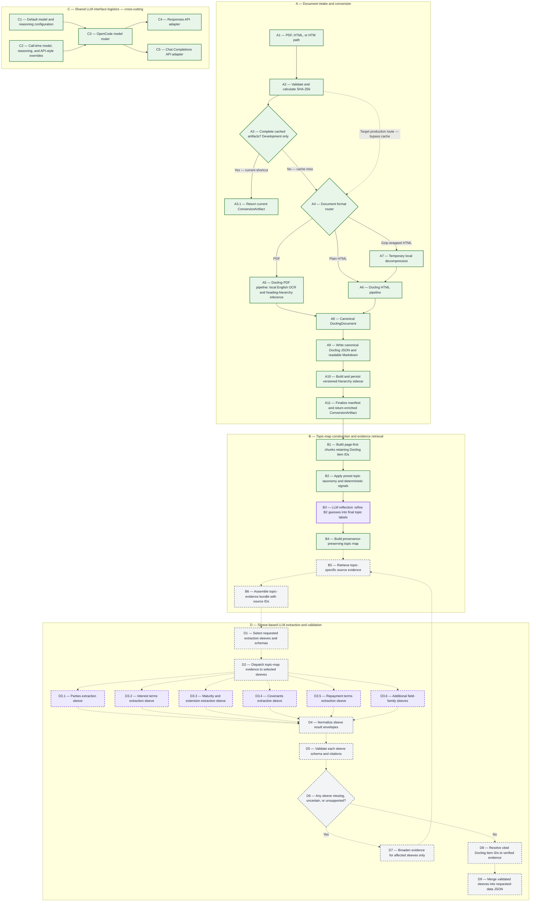

# Document Conversion and Extraction Pipeline

This document is the authoritative view of the credit-agreement pipeline. The
diagram distinguishes what exists today from the architecture we have agreed to
build next.

## Python entry point

```python
from credit_agreement_extractor import build_chunks, convert_document

artifact = convert_document("raw_documents/pdf/example.pdf")
chunks = build_chunks(artifact)

print(artifact.docling_json_path)
print(artifact.hierarchy_json_path)
print(artifact.markdown_path)
print(artifact.manifest_path)
print(chunks.chunks_json_path)
```

The default output root is `tmp/converted/`. Each source is placed in a folder
named with its SHA-256 fingerprint. Callers do not calculate or supply this
fingerprint: the function calculates it from the source bytes. Repeating a call
with identical source bytes reuses a complete cached conversion only when its
conversion-profile identifier also matches the current settings.

The cache short circuit is currently a development optimization. A cache entry
is complete only if it contains all four artifacts, uses the current conversion
profile, and has a schema-version-1 hierarchy sidecar with the same source
fingerprint. Production cache policy remains a separate decision.

## Conversion artifact contract

The completed Stage A artifact will contain four files:

- `document.docling.json` is the canonical conversion. It remains unchanged
  after Docling exports it and retains Docling item identifiers and available
  provenance such as page numbers, character spans, and bounding boxes.
- `document.md` is a readable derivative for manual review and debugging. It is
  not the downstream source of truth.
- `document.hierarchy.json` is the A10 sidecar. It adds generic heading
  paths and hierarchy-quality warnings keyed by canonical Docling item IDs. It
  does not copy or rewrite the complete document.
- `manifest.json` records source identity, converter version, OCR and heading-
  hierarchy configuration, conversion profile, gzip normalization, artifact
  names, and final conversion status.

All four outputs are implemented and tested. A10 builds and persists the
hierarchy mapping after canonical serialization. A11 writes the completed
manifest last and returns the enriched artifact only after every output exists.

OCR is enabled only for PDF conversion. The manifest records configuration, not
a claim that OCR was necessary on a particular born-digital page; Docling's OCR
mode decides which page regions need recognition.

Several SEC-sourced `.htm` files are actually gzip streams. The function detects
the gzip signature from the bytes, creates a temporary plain-HTML copy for
Docling, and removes that copy afterward. It never rewrites the source file.

## Frozen hierarchy design

Within A5, Docling's built-in heading-hierarchy inference is enabled for PDF
conversion so the canonical export contains all structure Docling can recover.
A5 also enables parsed-page generation, records both settings in the manifest,
and uses a distinct conversion profile so older caches are not reused.

A10's pure builder consumes the canonical JSON and produces the in-memory
sidecar mapping with:

- generic heading depths and ancestor paths rather than legal-specific labels
  such as `Article`, `Section`, or `Clause`;
- mappings keyed by canonical IDs such as `#/texts/17` and `#/tables/3`;
- page provenance copied from the referenced canonical items;
- one small warning taxonomy: `no_headings`, `flat_levels`,
  `skipped_levels`, and `non_monotonic_pages`;
- explicit validation failures for broken references or cycles rather than
  treating corrupt structure as a warning.

Hierarchy is useful context, not an authority that can discard content. The
builder does not alter reading order, rewrite source text, infer legal meaning,
or remove items. When hierarchy is sparse or imperfect, Stage B still has the
canonical page-first reading order. Persisting this mapping as
`document.hierarchy.json` and adding it to Stage A's cache/artifact contract are
implemented through A11.

## B1 chunk artifact contract

B1 is implemented as a separate Stage B operation:

```python
chunks = build_chunks(artifact)
```

It reads the canonical Docling JSON and A10 hierarchy sidecar and writes:

```text
tmp/stage_b/<source-sha256>/document.chunks.json
```

The chunk artifact is schema-versioned and records its source fingerprint,
chunking profile, and SHA-256 hashes for both Stage A JSON inputs. It contains
deterministic chunk IDs, neighbor links, exact canonical item IDs, verified
pages, source wording, table renderings, hierarchy paths, and container/list
relationships. It does not duplicate bounding boxes or character spans; those
remain resolvable from canonical JSON through each retained item ID.

PDFs use page-first boundaries. Large pages split only between atomic units,
while individual leaves, tables, and explicit Docling lists remain intact.
Fully page-less documents use heading-aware reading-order chunks targeting
12,000 characters. B1 creates no overlap and never fabricates page provenance.

The persisted file also acts as a development cache. A source, profile, schema,
or Stage A input-hash mismatch rebuilds only B1 and does not rerun Docling.

## Topic-map and evidence rule

B2 is implemented through `classify_chunks(chunks)`. It writes
`document.topic-signals.json` beside the B1 artifact, recording a versioned
taxonomy/rule set, the B1 file hash, and one provisional classification per
chunk. Eight topics cover parties, facilities, interest, maturity, repayment,
covenants, guarantees/security, and defaults/remedies. PIK toggle and call
protection are explicit subtopics that also assign their parent topics.

Matching uses case-insensitive phrases, heading context, bounded wildcards,
benchmark aliases, and nearby phrase combinations. Signals retain exact matched
wording, rule IDs, source kinds, and canonical evidence IDs, without strength
scores or categories. B3 independently assesses the source and refines these
guesses into final labels. Every chunk reaches B3, including unmatched chunks.

## B3/B4 contracts and local observability

`reflect_topics(chunks, signals)` is implemented. It sends up to five chunks
per batch, bounded by 24,000 serialized evidence characters (oversized atomic
chunks run alone), using `gpt-5.6-luna` with high reasoning by default. Model,
reasoning effort, and API style can be overridden. Source text, table content,
heading context, and B2 proposals reach the model; verbose keyword signals do not.
The `b3-reflection-v2` prompt uses shared, versioned topic definitions from
`topic_taxonomy.py`, including boundaries between incidental party mentions,
payment defaults, interest terms, and prepayment premiums. Both the prompt and
definition hashes participate in checkpoint identity. Topic IDs and B2 rules
are unchanged; saved v1 runs remain historical evidence, not v2 evaluations.
The current full suite has 156 passing tests. The saved 29-chunk Amerigo run
still reflects v1; B4 preserves its B3 labels and citation sets exactly rather
than performing another classification or denoising pass. No live v2 quality
improvement has been measured yet.

B3 validates one result per chunk, approved topics only, and supporting item IDs
within each supplied chunk/heading context. It adds parents for approved
subtopics. There are no possible-topic buckets, confidence scores, Jev gates,
or second opinions. Two attempts maximum handle transient API or invalid-output
failures; authentication errors and model substitutions stop immediately.

Validated batches are checkpointed by input hashes and settings. Repeated calls
reuse matching checkpoints; `force=True` requests fresh classification. A failed
new run does not replace the last successfully completed result. B3 persists
`document.topic-classifications.json` beside B1; `build_topic_map(chunks,
classifications)` revalidates it and writes `document.topic-map.json`. B4 indexes
topic -> chunk IDs and cited canonical item IDs in source order, including an
explicit unclassified-chunk list. It neither summarizes content nor calls an LLM.

Stage C's shared `OpenCodeClient` implements explicit model routing, Responses
and Chat Completions adapters, and the application User-Agent required by the
tested gateway. Its general reasoning default is medium; B3 explicitly selects
high. Unknown model routes need an explicit supported API-style override.
Responses was verified live; Chat Completions is covered by fake HTTP tests,
not a paid live open-model trial. Model-returned identities must match B3 requests.

All public pipeline/file APIs accept `debug=False`, `run_id=None`, and
`trace_root='tmp/runs'`. Use one run ID across separately called stages to link
them. Metadata and LLM usage/latency/cost are always appended to
`tmp/runs/<run-id>/events.jsonl`; `debug=True` also copies intermediate artifacts,
prompts, responses, and validation diagnostics under `debug/`. Secrets and
authorization headers are excluded; hidden model reasoning is not captured.
`summarize_run(run_id)` aggregates requests, retries, usage, costs, failures,
and latency by model/stage/document. Costs are reported only for explicit
amount/currency objects, otherwise estimated from dated gateway rates or unknown.
The default pricing snapshot covers Luna inputs up to 272K tokens, checked
2026-10-01; other models/tiers need explicit rates. Reasoning tokens are already
included in output totals and are not charged twice. These estimates are not bills.

Phoenix is deferred and is not a runtime dependency. B5/B6 retrieval and Stage D
extraction sleeves remain pending. Small smoke tests verify wiring, not legal
classification accuracy across the corpus.

Implemented B1 begins from canonical Docling items and builds page-first chunks. Page
boundaries guide chunk starts and ends, while tables remain atomic where
practical and lists are not split midway. Each chunk keeps its item IDs, page
numbers, neighboring chunk links, and any A10 heading path.

Every chunk receives zero or more provisional topic labels from the preset
credit-agreement taxonomy. B3 refines B2's proposals with a batched LLM
reflection step, whose final labels feed the provenance-preserving topic map;
neither may replace the underlying
source text with a summary. The map retrieves likely evidence for a requested
field, and request assembly sends that original evidence and its identifiers to
the extraction model.

The extraction model may cite retained item identifiers, but it must not invent
page numbers or coordinates. Application code resolves cited identifiers and
copies verified provenance into the structured result. Missing or uncertain
required fields trigger broader retrieval from the topic map.

Stage D uses independently testable extraction sleeves. Each sleeve owns one
coherent field family, its system prompt, response schema, topic-map evidence
packet, and validation rules. Initial sleeves cover parties, interest terms,
maturity and extension, covenants, and repayment terms. A run may invoke only
the sleeves required by the requested output, and additional sleeves can be
added without redesigning the rest of the pipeline.

Sleeves return a common result envelope containing structured values,
uncertainty, and cited Docling item IDs. Each sleeve is validated independently;
only a failed or incomplete sleeve broadens its evidence retrieval. Validated
sleeve results are then merged into the requested document-level JSON.

Stage C is a cross-cutting interface rather than a step in the document data
flow. Every purple LLM box uses the shared routing and transport contract in
Stage C, while supplying its own system prompt, evidence, and response schema.
The diagram therefore keeps C isolated instead of routing document artifacts
through its adapter boxes.

## Pipeline

### Human review surface

The implemented read-only HTML exporter in `review.py` is an inspection surface,
not a new document-processing stage. It loads an existing debug run and exposes
A conversion artifacts, B1 source chunks, B2 provisional labels/rule evidence,
B3 final classifications and model attempts, B4 topic assignments, and C
provider payloads/responses. Original source text, pages, tables and heading
context are displayed beside labels; clicking a citation focuses its source.
Unclassified chunks remain reviewable. B2 filters and highlights its own rule
matches, while B3/B4 use final labels/citations. Raw inputs, output artifacts
and events are expandable. Narrow browser panels use source/results switching;
wide browsers show them side-by-side.

Exports are snapshots, refreshed by rerunning the export command in README.
They do not run conversion/models or invent outputs for B5/B6/D. Stage A's
substeps were not separately traced in the current evaluation run. The full
live pipeline/progress dashboard is parked; Phoenix remains deferred.

### Architecture diagram

Status and cognitive work use separate visual signals:

- Capital letters identify major stages; numbers identify components within a
  stage, such as `A10` or `B3`.
- Solid borders and arrows mean implemented and tested.
- Dashed borders and arrows mean pending.
- Amber boxes identify provisional planned steps whose design is still subject
  to change.
- Purple boxes identify LLM or other cognitive inference steps, regardless of
  implementation status.

A10, A11, and B1 are implemented and tested. Their boxes and the A11-to-B1
connection are solid. B1-to-B2-to-B3-to-B4 is solid; B3 is purple because it
uses an LLM. B4-to-B5 and later connections remain dashed: retrieval and
extraction are pending. Shared C1–C5 transport is implemented and tested.



The development cache shortcut returns through A3.1 only when all four files
and their recorded identities validate. On a cache miss, A9 writes canonical
JSON and Markdown, A10 builds and persists the sidecar, and A11 writes the
completed manifest last before returning the enriched artifact.

B1 runs separately through `build_chunks()`. It reuses a validated Stage B
artifact when possible; otherwise it deterministically rebuilds
`document.chunks.json` from the two Stage A JSON artifacts. B1 is now the solid
handoff from completed conversion into implemented B2/B3/B4 topic mapping.
