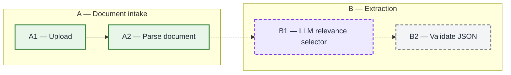

# Maintaining Pipeline Diagrams Skill Implementation Plan

> **For agentic workers:** REQUIRED SUB-SKILL: Use superpowers:subagent-driven-development (recommended) or superpowers:executing-plans to implement this plan task-by-task. Steps use checkbox (`- [ ]`) syntax for tracking.

**Goal:** Create one tested Mermaid pipeline-status skill and make it globally discoverable by Claude, OpenCode, and Codex.

**Architecture:** Store the canonical skill under the user's Obsidian `Skills` directory and expose it through symbolic links in each runtime's global skill directory. Validate the skill structurally and compare an independent agent's behavior before and after loading it.

**Tech Stack:** Agent Skills `SKILL.md`, YAML, Mermaid, POSIX symbolic links, Codex skill validator

## Global Constraints

- Canonical skill name: `maintaining-pipeline-diagrams`.
- Invoke it proactively when building or materially extending a system with four or more interacting components.
- Maintain one canonical copy; do not duplicate the skill across runtimes.
- A node or connection becomes implemented only when code, tests, or equivalent execution evidence verifies it.
- Preserve the approved green/gray/purple and solid/dashed visual contract.
- Group major stages with capital letters and number every box or decision within its stage.
- Do not alter project source documents or unrelated global skills.

---

### Task 1: Author and behavior-test the canonical skill

**Files:**
- Create: `/Users/ashrit/Library/Mobile Documents/iCloud~md~obsidian/Documents/Obsidian_ashrit/Skills/maintaining-pipeline-diagrams/SKILL.md`
- Create: `/Users/ashrit/Library/Mobile Documents/iCloud~md~obsidian/Documents/Obsidian_ashrit/Skills/maintaining-pipeline-diagrams/agents/openai.yaml`
- Test: independent-agent baseline and guided Mermaid outputs in `/tmp/maintaining-pipeline-diagrams-test/`

**Interfaces:**
- Consumes: a Mermaid pipeline diagram or a description of pipeline components and their verified status.
- Produces: a created or updated Mermaid diagram with lettered stages, numbered components, a textual legend, and consistent node/link status semantics.

- [ ] **Step 1: Run the baseline scenario without the skill**

Ask an independent fresh-context agent:

```text
Create a Mermaid flowchart for this pipeline and include a short legend:
upload is implemented and tested; parsing is implemented and tested;
an LLM selector is planned; JSON validation is planned. Show what is done,
what is pending, and which step is cognitive. Return only the Markdown needed
for a project architecture document.
```

Save its response to `/tmp/maintaining-pipeline-diagrams-test/baseline.md` and
record whether it independently satisfies all visual-contract rules from
the design spec. Expected: at least one rule is absent or ambiguous, proving
that the skill supplies non-obvious reusable guidance.

- [ ] **Step 2: Create the canonical skill files**

Create `SKILL.md` with:

```markdown
---
name: maintaining-pipeline-diagrams
description: Use when beginning or materially extending a system with four or more interacting components, or when creating or updating a Mermaid architecture, workflow, or pipeline diagram.
---

# Maintaining Pipeline Diagrams

## Overview

Create and keep one authoritative Mermaid diagram synchronized with verified
pipeline reality. Encode implementation status separately from whether a step
is cognitive.

## Workflow

1. When a system has four or more interacting components, find its existing
   authoritative diagram or create one early if none exists.
2. Update that diagram instead of adding a competing view unless the user asks
   for a new one.
3. Inspect code, tests, execution output, and project documentation relevant to
   every changed node and connection.
4. Classify each node as deterministic or cognitive, then as implemented and
   verified or pending.
5. Classify each connection as wired and verified or pending.
6. Divide the system into coherent major stages labeled `A`, `B`, `C`, and so
   on. Give every component and decision a visible stage-local reference such
   as `A1`, `A2`, or `B1`.
7. Preserve existing references when the flow remains recognizable. If a stage
   is materially reorganized, renumber that stage cohesively and update nearby
   prose references.
8. Update the diagram and its concise text legend together.
9. Render or parse-check Mermaid when a suitable tool is available.

Uncertain status remains pending. Never infer implementation from a roadmap,
stub, filename, or prose claim alone.

## Visual Contract

| Meaning | Appearance |
|---|---|
| Major stage | Capital letter and descriptive subgraph title |
| Component or decision | Visible stage letter plus sequence number |
| Implemented deterministic node | Green fill, solid green border |
| Pending deterministic node | Neutral gray fill, dashed gray border |
| Implemented cognitive node | Purple fill, solid purple border |
| Pending cognitive node | Purple fill, dashed purple border |
| Wired and verified connection | Solid arrow |
| Planned or unverified connection | Dashed arrow |

Use these Mermaid definitions:

```mermaid
classDef implemented fill:#e8f5e9,stroke:#2e7d32,stroke-width:2px,color:#1f2937;
classDef pending fill:#f3f4f6,stroke:#6b7280,stroke-width:2px,stroke-dasharray:6 4,color:#1f2937;
classDef cognitiveImplemented fill:#ede9fe,stroke:#7c3aed,stroke-width:2px,color:#1f2937;
classDef cognitivePending fill:#ede9fe,stroke:#7c3aed,stroke-width:2px,stroke-dasharray:6 4,color:#1f2937;
```

Use `-->` for verified connections and `-.->` for pending connections. A
cognitive node stays purple regardless of status; its border communicates
whether it is implemented.

## Example



Legend: solid means implemented and verified; dashed means pending; purple
means LLM or cognitive inference.

## Common Mistakes

- Do not mark a node implemented merely because it appears in a design or has a
  scaffold.
- Do not use purple to mean pending; purple means cognitive.
- Do not make an arrow solid when the downstream integration is not wired and
  verified.
- Do not silently change the visual vocabulary or omit the legend.
- Do not leave a box or decision unnumbered in a multi-stage system.
- Do not reuse one reference for two components.
- Do not renumber stable components merely for cosmetic reasons.
- Do not replace a useful detailed diagram with a simplified one unless asked.
```

Create `agents/openai.yaml` with:

```yaml
interface:
  display_name: "Maintaining Pipeline Diagrams"
  short_description: "Keep Mermaid pipeline status diagrams accurate"
  default_prompt: "Use $maintaining-pipeline-diagrams to update this Mermaid pipeline diagram from verified implementation status."
policy:
  allow_implicit_invocation: true
```

- [ ] **Step 3: Validate the canonical skill structure**

Run:

```bash
python3 /Users/ashrit/.codex/skills/.system/skill-creator/scripts/quick_validate.py "/Users/ashrit/Library/Mobile Documents/iCloud~md~obsidian/Documents/Obsidian_ashrit/Skills/maintaining-pipeline-diagrams"
```

Expected: validation succeeds with no frontmatter, naming, or placeholder
errors.

- [ ] **Step 4: Run the guided scenario with the skill**

Ask a new independent fresh-context agent to read the canonical `SKILL.md` and
then run the exact scenario from Step 1. Save the response to
`/tmp/maintaining-pipeline-diagrams-test/guided.md`.

Expected: the output uses lettered stage groups and numbers every box or
decision within its stage. It also includes a concise legend, green solid
implemented nodes, gray dashed pending deterministic nodes, a purple dashed
selector node, solid arrows only between the verified upload and parsing
stages, and dashed arrows for all pending flows.

- [ ] **Step 5: Compare results and refine only observed gaps**

Inspect both outputs manually against the six visual-contract rules. If the
guided output misses a rule, tighten only the corresponding instruction and
repeat Steps 3 and 4 until all rules pass.

---

### Task 2: Install and verify all global entry points

**Files:**
- Create symlink: `/Users/ashrit/.claude/skills/maintaining-pipeline-diagrams`
- Create symlink: `/Users/ashrit/.config/opencode/skills/maintaining-pipeline-diagrams`
- Create symlink: `/Users/ashrit/.codex/skills/maintaining-pipeline-diagrams`
- Modify: `/Users/ashrit/Library/Mobile Documents/iCloud~md~obsidian/Documents/Obsidian_ashrit/Projects/Credit Agreement Parser.md`

**Interfaces:**
- Consumes: the validated canonical skill directory from Task 1.
- Produces: three runtime-specific discovery paths resolving to identical skill content.

- [ ] **Step 1: Verify installation targets are free**

Run `ls -ld` on all three destination paths. Expected: each path is absent. If
any path exists, inspect it and stop rather than overwriting it.

- [ ] **Step 2: Create the three symbolic links**

Run `ln -s` once for each destination, always targeting the canonical Obsidian
skill directory. Do not copy files.

- [ ] **Step 3: Verify link identity and content**

Run `readlink` for each destination and `cmp` each linked `SKILL.md` against the
canonical file. Expected: all links report the same canonical target and all
comparisons exit successfully.

- [ ] **Step 4: Re-run validation through every runtime path**

Run `quick_validate.py` against the Claude, OpenCode, and Codex symlink paths.
Expected: all three validations succeed.

- [ ] **Step 5: Record the reusable skill in the project note**

Add a concise checkpoint to `Credit Agreement Parser.md` stating the skill
name, canonical location, three global consumers, and visual contract. Do not
rewrite unrelated note content.

- [ ] **Step 6: Final verification**

Confirm the canonical files and symlinks exist, the validator passes from all
three paths, and the guided behavior test satisfies every visual-contract rule.
